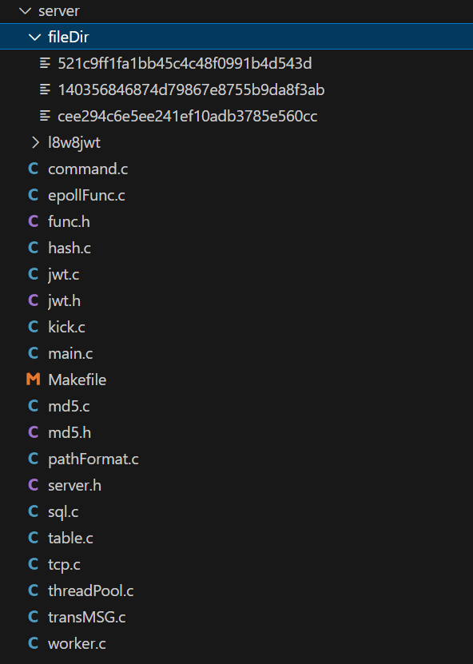
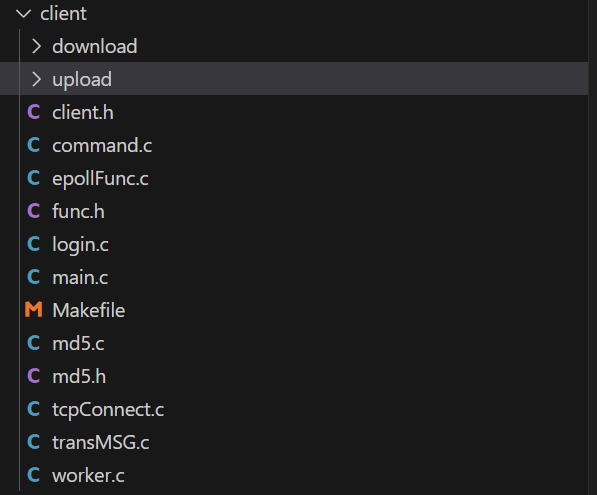
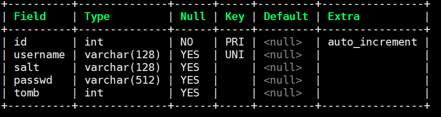
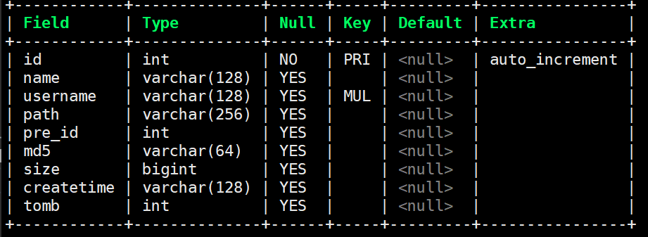
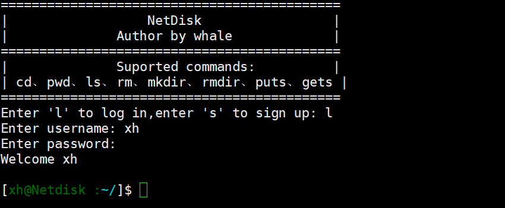
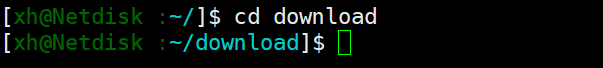
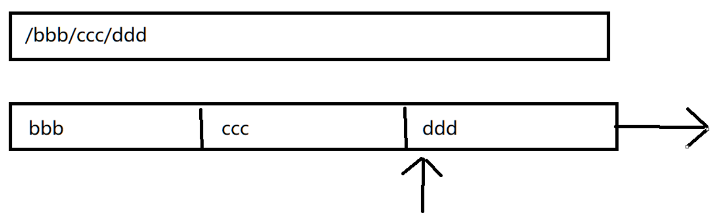
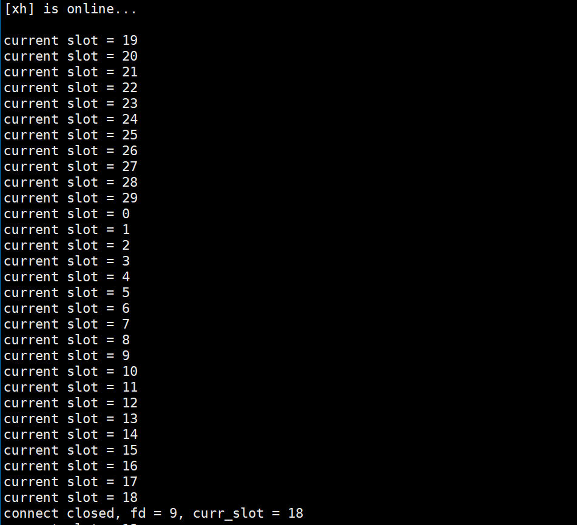

# 私有协议文件管理服务器


## 服务端：

- 使用epoll与多个客户端建立**TCP连接**
- 使用**线程池**完成客户端**长命令**（gets/puts）请求，主线程负责监听与处理**短命令**
- 使用自定义**小火车协议**传输文件，具有断点续传和秒传功能
- 注册与登录功能，用户信息存入MySQL数据库，并以密文形式存储密码，登录成功后会生成Token发送给客户端用于身份验证
- 在**系统日志**中记录客户端的连接信息、操作记录、操作时间等
- 大文件传输优化（mmap）
- 文件存储，所有用户的文件存在同一个真实目录中，以md5值作为文件名，同一份文件只存储一份。
- **超时断开连接**，使用环形队列实现已连接的客户端在30秒内未操作就断开连接
- **虚拟文件表**，各个客户端只能操作自己的文件，虚拟的目录树存在MySQL中


**所有上传文件均放在fileDir目录中**



## 客户端：

- 命令：cd，ls，pwd，rm，mkdir，rmdir，puts，gets
- 长短命令分离：puts、gets命令交给子线程，子线程与服务器建立新的连接，验证Token后I/O文件
- 非法命令会提示


**上传的文件在upload中，下载的文件在download中**




## 1.数据库设计

- 创建数据库myNetdisk

```mysql
create database myNetdisk;
```

- 用户表

```mysql
create table user (id int primary key auto_increment, username varchar(128) unique, salt varchar(128), passwd varchar(512), tomb int);
```



- 虚拟文件表

```mysql
create table tree (id int primary key auto_increment, name varchar(128), username varchar(128), path varchar(256), pre_id int, md5 varchar(64), size bigint, createtime varchar(128),tomb int, unique key idx_username_path (username, path));
```



## 2.注册与登录



+ 在 tcp 连接后就可以开始注册/登录，只实现了注册或者登录
+ 使用 getpass 函数实现输入密码不显示的功能
+ 用户在客户端输入账号和密码，用明文传给服务端
+ 需要随机生成盐值加密后再存储到数据库中
+ 如果是注册，服务端先查表，没有就插入一行数据

```c++
sprintf(sql,"select username from user where username = '%s';",tmpuser.userName);
sprintf(sql,"insert into user (username,salt,passwd,tomb) values ('%s','%s','%s',0);",tmpuser.userName,saltnum,saltresult);
```

- 如果是登录，服务端直接找用户名，分为两种情况，用户名不存在和密码不正确

```c++
sprintf(sql,"select salt, passwd, tomb from user where username = '%s';",tmpuser.userName);
```

- 盐值生成

```c
int salt(char *saltnum)
{
    srand(time(NULL));
    printf("salt begin\n");
    saltnum[0] = '$';
    saltnum[1] = '6';
    saltnum[2] = '$';
    // 随机生成中间16位
    const char char16[] = "abcdefghijklmnopqrstuvwxyzABCDEFGHIJKLMNOPQRSTUVWXYZ0123456789";

    for (int i = 0; i < 16; i++)
    {
        saltnum[3 + i] = char16[rand() % (sizeof(char16) - 1)];
    }
    saltnum[19] = '$';
    printf("salt end\n");

    return 0;
}
```

## 3.cd



+ 服务端在缓存中存有当前路径，客户端发来一个相对路径/绝对路径（以 / 开头为区分）
+ 相对路径解决起来比较麻烦，要一个一个查表

```c
sprintf(sql,"select path from tree where pre_id = %d and username = '%s' and tomb = 0;",row[0],username);
```



```c
if (strcmp(cmd, "cd") == 0)
{
    puts("\n===================================");
    puts("|                cd               |");
    puts("===================================");
    int cdRet = changeDir(mysql, pThreadPool->userBuffer[netFd], pThreadPool->pathBuffer[netFd], srcPath);
    if (cdRet == -1)
    {
        sendMessageToClient(netFd, "cd: directory does not exist", 28);
    }
    else
    {
        sendMessageToClient(netFd, "Not display", 11);
    }
    sendCurPath(netFd, pThreadPool->pathBuffer[netFd], sizeof(pThreadPool->pathBuffer[netFd]));
}
```

## 4.ls


- 先取出当前目录的 id， 然后再 pre_id 里找当前 id

```c
sprintf(sq, "select id from tree where username = '%s' and path = '%s';\n", username, curr_path);
sprintf(sq, "select name,md5,size,createtime from tree where pre_id = %s and tomb = 0;", row[0]);
```

```c
int listSearch(MYSQL *mysql, const char *username, const char *curr_path, char *list)
{
    // sq保存query语句
    char sq[1024] = {0};
    sprintf(sq, "select id from tree where username = '%s' and path = '%s';\n", username, curr_path);
    int qret = mysql_query(mysql, sq);
    QUERY_CHECK(qret, mysql);
    MYSQL_RES *result = mysql_store_result(mysql);
    MYSQL_ROW row = mysql_fetch_row(result);
    // row[0]就是当前目录的id
    sprintf(sq, "select name,md5,size,createtime from tree where pre_id = %s and tomb = 0;", row[0]);
    qret = mysql_query(mysql, sq);
    QUERY_CHECK(qret, mysql);
    result = mysql_store_result(mysql);
    while ((row = mysql_fetch_row(result)) != NULL)
    {
        strcat(list, row[3]);
        strcat(list, "  ");
        strcat(list, row[2]);
        strcat(list, "\t");
        strcat(list, row[0]);
        if (strcmp(row[1], "0") == 0)
        {
            strcat(list, "/");
        }
        strcat(list, "\n");
    }
    return 0;
}
```

## 5.mkdir

+  mkdir 命令可以在相对路径下创建目录，但路径中不能有不存在的目录
+ 相对路径创建文件的功能是基于 cd 实现的
+ 先找是否有 tomb = 1 的目录

```c
sprintf(sql,"select * from tree where path = '%s' and username = '%s' and tomb = 1;",path, username);
```

+ 然后找目录是否存在：复制一份缓存中的当前路径，把路径参数传入修改的 cd 命令中（可以转换路径到任意目录或文件，不存在就报错）
+ 接着判断要创建的目录前的一串目录是否有不存在

```c
int makeDir(MYSQL *mysql, char *userName, char *curr_path, char *dirpath)
{
    char path[256] = {0};
    memcpy(path, curr_path, strlen(curr_path));
    printf("curPath = %s\n", path);
    printf("userName = %s\n", userName);
    printf("dirpath = %s\n", dirpath);
    if (changePath(mysql, userName, path, dirpath) != -1)
    {
        char sql[1024] = {0};
        sprintf(sql, "select * from tree where path = '%s' and username = '%s' and tomb = 1;", path, userName);
        int qret = mysql_query(mysql, sql);
        if (qret != 0)
        {
            fprintf(stderr, "makeDir:%s\n", mysql_error(mysql));
        }
        MYSQL_RES *result = mysql_store_result(mysql);
        MYSQL_ROW row = mysql_fetch_row(result);
        if (!row)
        {
            printf("文件夹已存在\n");
            return 0;
        }
        else
        {
            bzero(sql, sizeof(sql));
            time_t createtime;
            time(&createtime);
            char *t = ctime(&createtime);
            if (t[strlen(t) - 1] == '\n')
                t[strlen(t) - 1] = '\0';
            sprintf(sql, "update tree set tomb = 0, createtime = '%s' where path = '%s' and username = '%s';", t, path, userName);
            int qret = mysql_query(mysql, sql);
            if (qret != 0)
            {
                fprintf(stderr, "makeDir:%s\n", mysql_error(mysql));
            }
            return 1;
        }
    }
    else
    {
        puts("555");
        bzero(path, sizeof(path));
        memcpy(path, curr_path, strlen(curr_path));
        char left[128] = {0}, right[128] = {0};
        cutTail(dirpath, left, right);
        printf("left = %s\nright = %s\n", left, right);
        if (changePath(mysql, userName, path, left) == -1)
        {
            printf("路径不存在\n");
            return 0;
        }
        else
        {
            int id;
            getId(mysql, userName, path, &id);
            if (strcmp(path, "/"))
            {
                strcat(path, "/");
            }
            strcat(path, right);
            char sql[1024] = {0};

            time_t createtime;
            time(&createtime);
            char *t = ctime(&createtime);
            if (t[strlen(t) - 1] == '\n')
                t[strlen(t) - 1] = '\0';
            sprintf(sql, "insert into tree (name,username,path,pre_id,md5,tomb,size, createtime) values('%s','%s','%s',%d,'0',0,0, '%s') ;", right, userName, path, id, t);
            int qret = mysql_query(mysql, sql);
            if (qret != 0)
            {
                fprintf(stderr, "makeDir:%s\n", mysql_error(mysql));
            }
        }
    }
    return 1;
}
```

## 6.rmdir

```c
int removeDir(MYSQL *mysql, char *username, char *curr_path, char *dirpath)
{
    char path[256] = {0};
    memcpy(path, curr_path, strlen(curr_path));
    if (changePath(mysql, username, path, dirpath) == -1)
    {
        return 0;
    }
    else
    {
        char sql[1024] = {0};
        sprintf(sql, "select id from tree  where path='%s' and md5='0' and username = '%s';", path, username);
        int qret = mysql_query(mysql, sql);
        if (qret != 0)
        {
            fprintf(stderr, "rmdir select:%s\n", mysql_error(mysql));
        }
        MYSQL_RES *result = mysql_store_result(mysql);
        MYSQL_ROW row = mysql_fetch_row(result);
        if (row == NULL)
        {
            return 0;
        }
        else
        {
            bzero(sql, sizeof(sql));
            sprintf(sql, "select * from tree where pre_id=%d and username = '%s' and tomb = 0;", atoi(row[0]), username);
            qret = mysql_query(mysql, sql);
            if (qret != 0)
            {
                fprintf(stderr, "rmdir select:%s\n", mysql_error(mysql));
            }
            MYSQL_RES *ret = mysql_store_result(mysql);
            MYSQL_ROW r = mysql_fetch_row(ret);
            if (r == NULL)
            {
                bzero(sql, sizeof(sql));
                sprintf(sql, "update tree set tomb=1 where path='%s' and username = '%s';", path, username);
                qret = mysql_query(mysql, sql);
                if (qret != 0)
                {
                    fprintf(stderr, "rmdir update:%s\n", mysql_error(mysql));
                }
                return 1;
            }
            else
            {
                return 0;
            }
        }
    }
    return 0;
}
```

## 7.rm

- 将表tree中文件的tomb设置为1

```c
int removeFile(MYSQL *mysql, const char *userName, char *curr_path, char *filePath)
{
    char path[256] = {0};
    memcpy(path, curr_path, strlen(curr_path));
    if (changePath(mysql, userName, path, filePath) == -1)
    {
        return 0;
    }
    else
    {
        char sql[1024] = {0};
        sprintf(sql, "update tree set tomb=1 where path='%s' and username = '%s';", path, userName);
        int qret = mysql_query(mysql, sql);
        if (qret != 0)
        {
            fprintf(stderr, "rm:%s\n", mysql_error(mysql));
        }
        return 1;
    }
}
```

## 8.pwd

- 一直存储在pathBuffer中

```c
if (strcmp(cmd, "pwd") == 0)
{
    puts("\n===================================");
    puts("|                pwd              |");
    puts("===================================");
    char curPath[256] = {0};
    strcpy(curPath, "~");
    strcat(curPath, pThreadPool->pathBuffer[netFd]);
    sendMessageToClient(netFd, curPath, strlen(curPath));
    sendCurPath(netFd, pThreadPool->pathBuffer[netFd], sizeof(pThreadPool->pathBuffer[netFd]));
}
```

## 9.puts与秒传

+ 基于**小火车**协议
+ 传递 md5 值，如果 md5 值存在即可秒传
+ 先发文件名，再发 md5 值，然后发文件长度，最后发文件
+ 目前仅支持上传到当前目录

```c
int sendFileToClient(int fd, char *fileName, char *md5)
{

    /*文件名*/
    train_t train;
    train.length = strlen(fileName);
    strcpy(train.data, fileName);
    send(fd, &train, train.length + sizeof(train.length), 0);

    /*接收偏移量*/
    off_t offset;
    recv(fd, &offset, sizeof(offset), 0);

    /*文件长度*/
    int filefd = open(md5, O_RDONLY);
    ERROR_CHECK(filefd, -1, "filefd");
    struct stat statbuf;
    fstat(filefd, &statbuf);
    train.length = sizeof(statbuf.st_size);
    memcpy(train.data, &statbuf.st_size, train.length);
    send(fd, &train, sizeof(train.length) + train.length, MSG_NOSIGNAL);
    
    /*文件*/
    sendfile(fd, filefd, &offset, statbuf.st_size - offset);
    close(filefd);
    return 0;
}
```

## 10.gets与断点续传

+ 服务端先给客户端发文件名，客户端收到后返回一个偏移量
+ 服务端收到偏移量后，就从偏移量开始传输
+ sendfile 系统调用

```c
int sendFileToServer(int fd, char *localPath, char *virtualPath)
{
    /*文件名*/
    train_t train;
    train.length = strlen(localPath);
    memcpy(train.data, localPath, train.length);
    send(fd, &train, sizeof(train.length) + train.length, MSG_NOSIGNAL);
    
    /*文件哈希值*/
    char md5[128];
    getFileMd5(localPath, md5);
    train.length = strlen(md5);
    memcpy(train.data, md5, train.length);
    send(fd, &train, sizeof(train.length) + train.length, MSG_NOSIGNAL);
    
    /*文件长度*/
    int filefd = open(localPath, O_RDONLY);
    ERROR_CHECK(filefd, -1, "filefd");
    struct stat statbuf;
    fstat(filefd, &statbuf);
    printf("%d\n", (int)statbuf.st_size);
    train.length = sizeof(statbuf.st_size);
    memcpy(train.data, &statbuf.st_size, train.length);
    send(fd, &train, sizeof(train.length) + train.length, MSG_NOSIGNAL);
    
    /*文件*/
    sendfile(fd, filefd, NULL, statbuf.st_size);
    close(filefd);
    return 0;
}
```

## 11.长短命令分离

### 11.1服务端

```c
while (1) {
    int readyCount = epoll_wait(epollFd, eventArr, listenNum, 1000);
    for (int i = 0; i < readyCount; ++i) {
        /* 事件一: 有新连接 */
        if (eventArr[i].data.fd == socketFd) {
            struct sockaddr_in clientAddr;
            int netFd = acceptConnection(socketFd, &clientAddr);
			epollAdd(epollFd, netFd); // 添加监听
            
			/* puts 和 gets 的新连接 */
			if (子线程的连接) {
    			pthread_mutex_lock(&threadPool.mutex);
    			taskEnqueue(&threadPool.taskQueue, netFd); // 加入任务队列
    			pthread_cond_signal(&threadPool.cond); // 唤醒子线程处理长命令
    			pthread_mutex_unlock(&threadPool.mutex);
			}
        /* 事件二: 处理短命令 */
        } else {
            /* 处理短命令 */
        }
    }
}
```

### 11.2客户端

```c
while (1)
{
    int readyNum = epoll_wait(epFd, readyArr, 2, -1);
    for (int i = 0; i < readyNum; ++i)
    {
        if (readyArr[i].data.fd == STDIN_FILENO)
        {
            char msgFromSTDIN[128] = {0};
            ssize_t stdinLength = recvStdin(msgFromSTDIN, sizeof(msgFromSTDIN));
            
            //解析命令
            
            // puts 和 gets 命令交给子线程处理
            // gets fileName:先进入文件所在目录，然后执行该命令； puts fileName:先进入文件想要保存的目录，然后上传到当前目录
            // 后期可设计为可在绝对路径下载/上传文件
            if (strcmp(cmd, "puts") == 0 || strcmp(cmd, "gets") == 0)
            {
                sendMessageToServer(sockFd, msgFromSTDIN, sizeof(msgFromSTDIN));
                char recvFdFromServer[8] = {0};
                recvMessageFromServer(sockFd, recvFdFromServer, sizeof(recvFdFromServer));
                recvCurPath(sockFd, curPath, sizeof(curPath));
                source_t source;
                sourceInit(&source, atoi(recvFdFromServer), msgFromSTDIN, Name, cmd, srcPath, dstPath, Token, curPath);
                // 创建线程处理命令
                pthread_t thread;
                pthread_create(&thread, NULL, threadFunc, &source);
            }
            else
            {
                // 其他短命令发给服务器主线程处理
                sendMessageToServer(sockFd, msgFromSTDIN, stdinLength);
            }
        }
        // 接收server服务器非gets/puts命令的数据
        else if (readyArr[i].data.fd == sockFd)
        {

        }
    }
}
```

- 创建子线程时，将主线程的netFd发送给子线程，让子线程处理该fd的命令

## 12.Token

- 服务端生成 token：以客户端传来的用户名作为 key 值，生成 token

```c
void createToken(char *username, char *token)
{
    char *jwt;
    size_t jwt_length;

    struct l8w8jwt_encoding_params params;
    l8w8jwt_encoding_params_init(&params);

    params.alg = L8W8JWT_ALG_HS512;

    params.sub = "myNetdisk";
    params.iss = "whale";
    params.aud = "whale99";

    params.iat = 0;
    params.exp = 0x7fffffff; /* Set to expire after 10 minutes (600 seconds). */

    params.secret_key = (unsigned char *)username;
    params.secret_key_length = strlen(params.secret_key);
    printf("len     =%ld\n", params.secret_key_length);
    params.out = &jwt;
    params.out_length = &jwt_length;

    int r = l8w8jwt_encode(&params);
    if (r == L8W8JWT_SUCCESS)
    {
        strcpy(token, jwt);
    }
    printf("\n l8w8jwt example HS512 token: %s \n", r == L8W8JWT_SUCCESS ? jwt : " (encoding failure) ");

    /* Always free the output jwt string! */
    l8w8jwt_free(jwt);
}
```

- 发送Token给客户端

```c
int sendTokenToClient(int fd, char *username, char *token)
{
    train_t train;
    memset(&train, 0, sizeof(train));
    /*username*/
    train.length = strlen(username);
    memcpy(train.data, username, train.length);
    ssize_t sendRet = send(fd, &train, sizeof(train.length) + train.length, 0);
    ERROR_CHECK(sendRet, -1, "send username");
    /*token*/
    train.length = strlen(token);
    memcpy(train.data, token, train.length);
    sendRet = send(fd, &train, sizeof(train.length) + train.length, 0);
    ERROR_CHECK(sendRet, -1, "send token");
    return 0;
}
```

- 客户端执行puts、gets命令时，携带Token传给服务端进行认证
- 认证成功返回1，否则返回0

```c
int verify(char *username, char *token)
{
    struct l8w8jwt_decoding_params params;
    l8w8jwt_decoding_params_init(&params);

    params.alg = L8W8JWT_ALG_HS512;

    params.jwt = (char *)token;
    params.jwt_length = strlen(token);

    params.verification_key = (unsigned char *)username;
    params.verification_key_length = strlen(username);

    /*
     * Not providing params.validate_iss_length makes it use strlen()
     * Only do this when using properly NUL-terminated C-strings!
     */
    params.validate_iss = "whale";
    params.validate_sub = "myNetdisk";

    /* Expiration validation set to false here only because the above example token is already expired! */
    params.validate_exp = 0;
    params.exp_tolerance_seconds = 60;

    params.validate_iat = 0;
    params.iat_tolerance_seconds = 60;

    enum l8w8jwt_validation_result validation_result;

    int decode_result = l8w8jwt_decode(&params, &validation_result, NULL, NULL);

    if (decode_result == L8W8JWT_SUCCESS && validation_result == L8W8JWT_VALID)
    {
        printf("\n Example HS512 token validation successful! \n");
        return 1;
    }
    else
    {
        printf("\n Example HS512 token validation failed! \n");
        return 0;
    }
}
```

## 13.设置定时器

+ 使用 epoll 的超时就绪实现定时器，就绪时间设为 1000ms
+ 每次 epoll_wait 返回 ，就让 timer = time(NULL)，就会跟随时间自增

## 14.环形队列



- 循环队列：定长数组实现，一共 30 个槽，每次 timer 前进就前进一个槽，有一个 currentSlot 指向当前的槽

```c
#define TIME_WHEEL_SIZE 30
//设置一个长度为30的循环队列
typedef struct time_wheel_s{
    //30个槽位，每个槽位一个集合
    HashSet* set[TIME_WHEEL_SIZE];
    //当前的槽位
    int curr_slot;
    //一个哈希表，用于记录fd在哪个槽位的集合里
    HashTable* table;
}time_wheel_t;
```

- HashTable设计：哈希表，键是文件描述符，值是槽位

```c
#define TABLE_SIZE 10
typedef struct Entry {
    int key;
    int value;
    struct Entry* next;
} Entry;
typedef struct{
    Entry* entries[TABLE_SIZE];
}HashTable;
```

- HashSet 设计：每个槽都有一个集合，用哈希表实现，存放槽内的文件描述符

```c
typedef struct {
    Entry* entries[TABLE_SIZE];
} HashSet;
```

## 15.日志系统

```c
#define LOG_WRITE(msg)                                                                                                                                                                       \
    {                                                                                                                                                                                        \
        int fd = open("/var/log/syslog", O_WRONLY | O_APPEND | O_CREAT, 0666);                                                                                                               \
        time_t now = time(NULL);                                                                                                                                                             \
        time(&now);                                                                                                                                                                          \
        struct tm *localTime = localtime(&now);                                                                                                                                              \
        char message[4096] = {0};                                                                                                                                                            \
        sprintf(message, "[%d-%d-%d][%d:%d:%d]: %s\n", localTime->tm_year + 1900, localTime->tm_mon + 1, localTime->tm_mday, localTime->tm_hour, localTime->tm_min, localTime->tm_sec, msg); \
        write(fd, message, strlen(message));                                                                                                                                                 \
        close(fd);                                                                                                                                                                           \
	}
```
